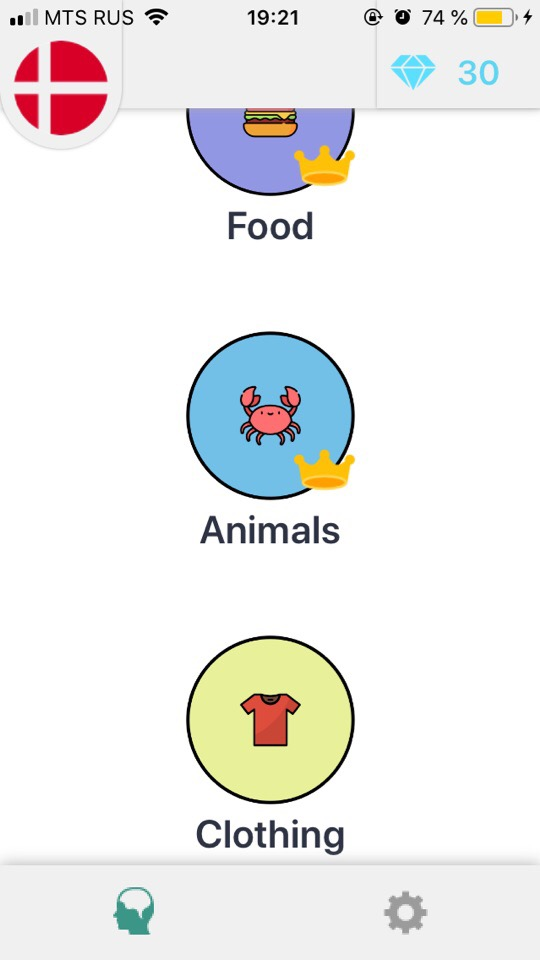
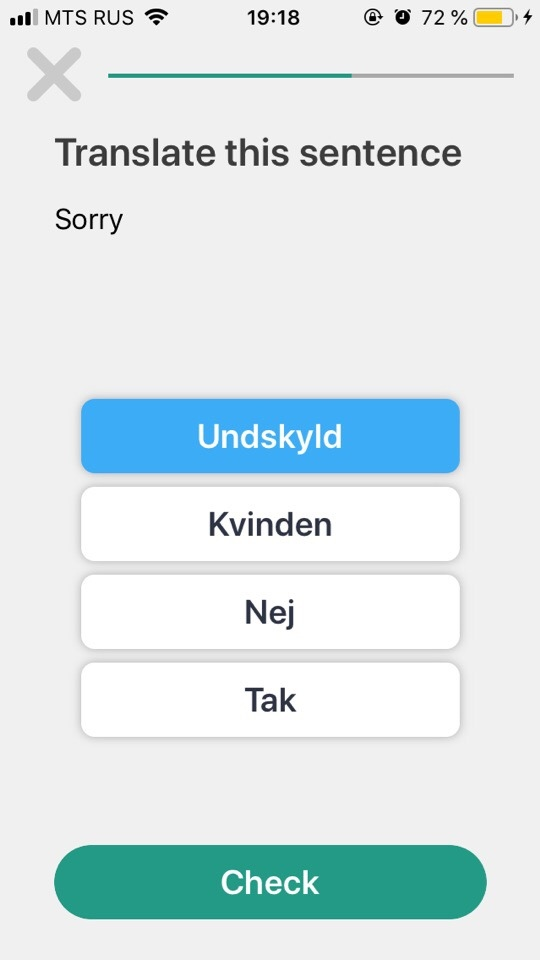
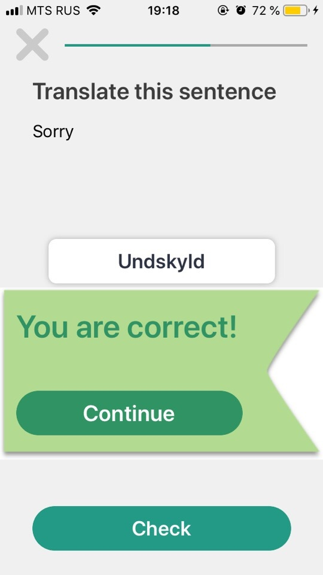
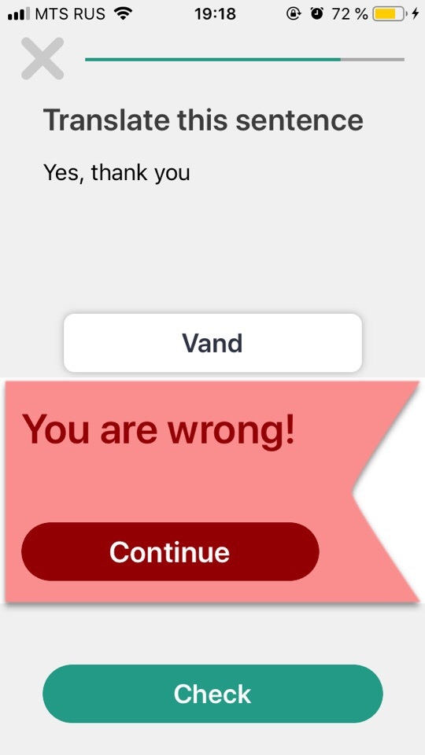

# paulingo

This application needs for training your skills in learning languages.
Techlogies: UIKit, Realm, animation

You may choose topic:

Simple tests check the most popular words in different topics:

If your answer is correct or wrong you will see appropriate screen:

  

When you pass all queations from one topic you will see congratulation animation:

